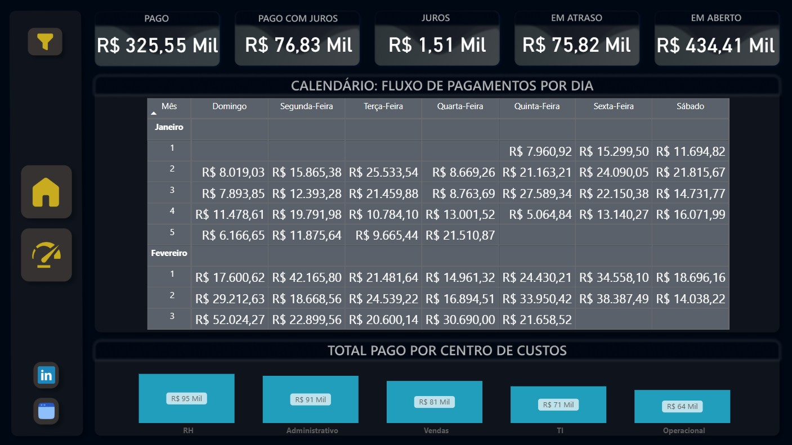
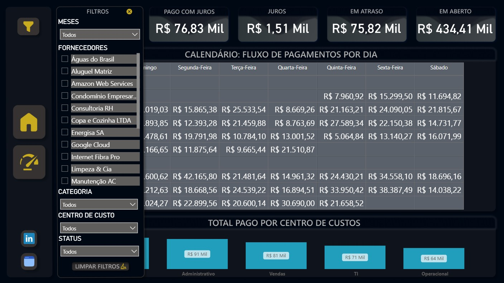
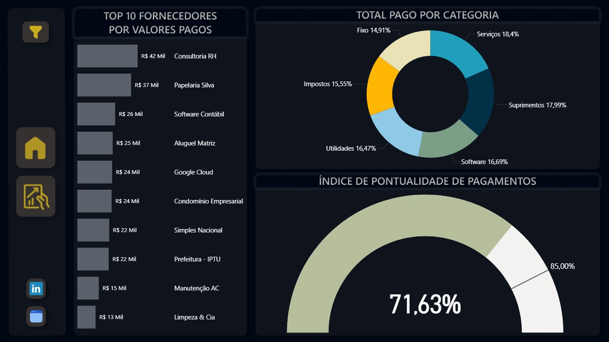
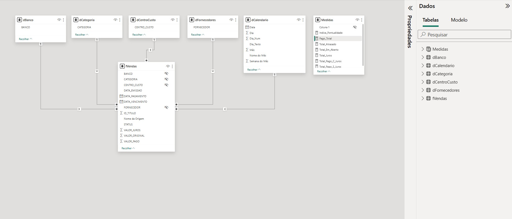

# Dashboard de Gestão Financeira - Contas a Pagar.

Este projeto consiste em um dashboard desenvolvido no **Power BI** utilizando dados fictícios criados especificamente para simular uma operação financeira real.

Este projeto foi um marco importante na minha jornada, sendo o **primeiro dashboard que desenvolvi do início ao fim de forma totalmente independente**, sem o auxílio de vídeo aulas ou roteiros de cursos.

## Descrição.
O dashboard foi construído para monitorar o fluxo de obrigações financeiras, permitindo uma gestão eficiente de vencimentos, pagamentos e saúde do fluxo de caixa. Toda a base de dados foi estruturada de forma fictícia para dar suporte às análises do projeto.

**O objetivo do dashboard é** fornecer uma visão clara do montante total a pagar, identificar gargalos de atrasos e medir o impacto de juros e multas no orçamento mensal.

## O Problema de Negócio.
Foi simulado um cenário onde uma empresa apresentava dificuldades em visualizar suas saídas de caixa efetuadas, futuras e em atraso e entender o custo gerado por pagamentos fora do prazo. O dashboard foi criado como uma solução para centralizar esses dados e gerar alertas visuais sobre os compromissos financeiros.

## Perguntas de Negócio.
O painel foi projetado para responder às seguintes questões:
1. Qual a porcentagem de contas pagas dentro do prazo?
2. Qual a porcentagem de contas que estão vencidas atualmente?
3. Qual o valor total pago em juros e multas devido a atrasos?
4. Qual a distribuição das despesas por categoria de custo?
5. Quais fornecedores possuem os maiores volumes de pagamentos pendentes?

## Metodologia.
O projeto seguiu as etapas fundamentais de um ciclo de BI, aplicando boas práticas de mercado, buscando garantir a performance e a integridade dos dados:

* **Tratamento e Transformação de Dados (ETL):** Utilização do Power Query para limpeza, tipagem e organização de tabelas baseadas em dados fictícios. Nesta etapa, também foi desenvolvida uma tabela dCalendar personalizada para suporte às análises de inteligência de tempo.
* **Modelagem de Dados:** Estruturação do modelo seguindo o formato **Star Schema (Esquema Estrela)**, com a devida separação e organização entre **Tabelas Fato e Tabelas Dimensão**.
* **Criação de Inteligência de Negócio (DAX):** Desenvolvimento de métricas para cálculos de juros acumulados, totais em atraso e indicadores percentuais.

<details>
<summary><b> Clique aqui para visualizar as principais métricas DAX.</b></summary>

```dax
Indice_Pontualidade = 
VAR TitulosNoPrazo = CALCULATE(COUNTROWS(fVendas), fVendas[STATUS] = "Pago", fVendas[VALOR_JUROS] <= 0)
VAR TotalVencidos = CALCULATE(COUNTROWS(fVendas), fVendas[STATUS] IN {"Pago", "Atrasado"})
RETURN
DIVIDE(TitulosNoPrazo, TotalVencidos, 0)

Pago_Total = 
VAR Pago_C_Juros = CALCULATE(SUM(fVendas[VALOR_PAGO]), fVendas[VALOR_PAGO], fVendas[VALOR_JUROS] > 0 )
VAR Pago_S_Juros = CALCULATE(SUM(fVendas[VALOR_ORIGINAL]), fVendas[STATUS] = "Pago", fVendas[VALOR_JUROS] <= 0)
RETURN 
Pago_C_Juros + Pago_S_Juros

Total_Atrasado = 
CALCULATE(
    SUM(fVendas[VALOR_ORIGINAL]), 
    fVendas[STATUS] = "Atrasado"
) + 0

Total_Em_Aberto = 
CALCULATE(
    SUM(fVendas[VALOR_ORIGINAL]), 
    fVendas[STATUS] = "Aberto"
) + 0

Total_Juros = 
CALCULATE(
    SUM(fVendas[VALOR_JUROS])
)

Total_Pago_C_Juros = 
CALCULATE(
    SUM(fVendas[VALOR_PAGO]), 
    fVendas[VALOR_JUROS] > 0 
) + 0 
```
</details>

<br>

* **UX/UI Design com Figma:** Pela **primeira vez e sendo o meu primeiro contato com a ferramenta**, utilizei o Figma para a prototipagem de todo o layout, buscando ter uma interface profissional e intuitiva para a experiência do usuário.
* **Visualização e Navegação:** Implementação de visuais, botões e abas de menus, assim como uma **aba retrátil de filtros sincronizados entre abas** para otimizar a experiência do usuário final.

## Insights Principais.
* Identificação de períodos críticos de vencimento que podem comprometer o fluxo de caixa.
* Detecção de categorias de custo que mais sofrem com a incidência de juros, seja por falta de liquidez imediata ou de controle de prazos.
* Otimização da visão operacional, permitindo antecipar pagamentos de grandes fornecedores.

## Prévia do Dashboard.

### Página 1: Home.


### Página 2: Operacional.


### Página 2: Operacional (Funcionamento da aba de filtro retátil).


### Página 3: Performance.


### Modelo de Dados:


## Base de Dados.
* Os dados utilizados foram gerados internamente em Excel para simular extrações de um sistema ERP corporativo.

## Tecnologias Utilizadas.
* **Excel** (Estruturação da base de dados fictícia)
* **Power BI** (Power Query, DAX, Visualização de Dados)
* **Figma** (Design de Interface e Layout)

---
**Projeto Idealizado e Desenvolvido por:** Pedro Ramos