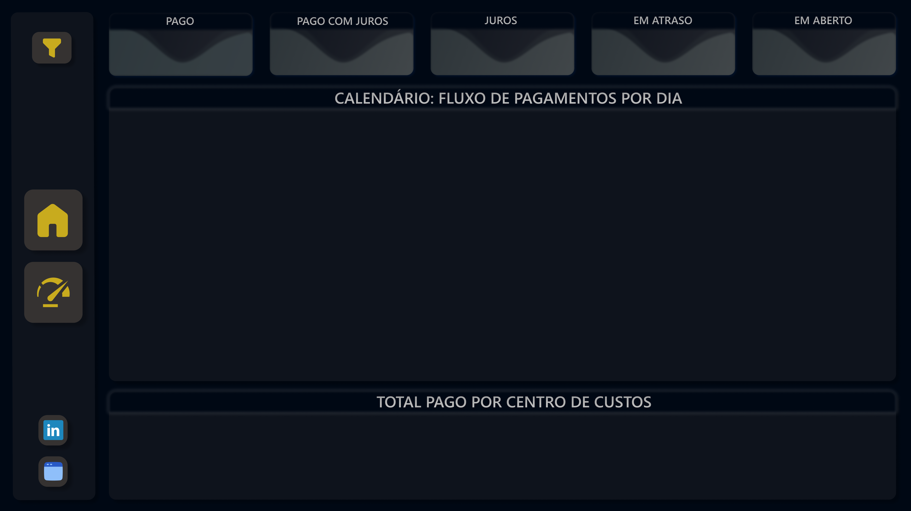
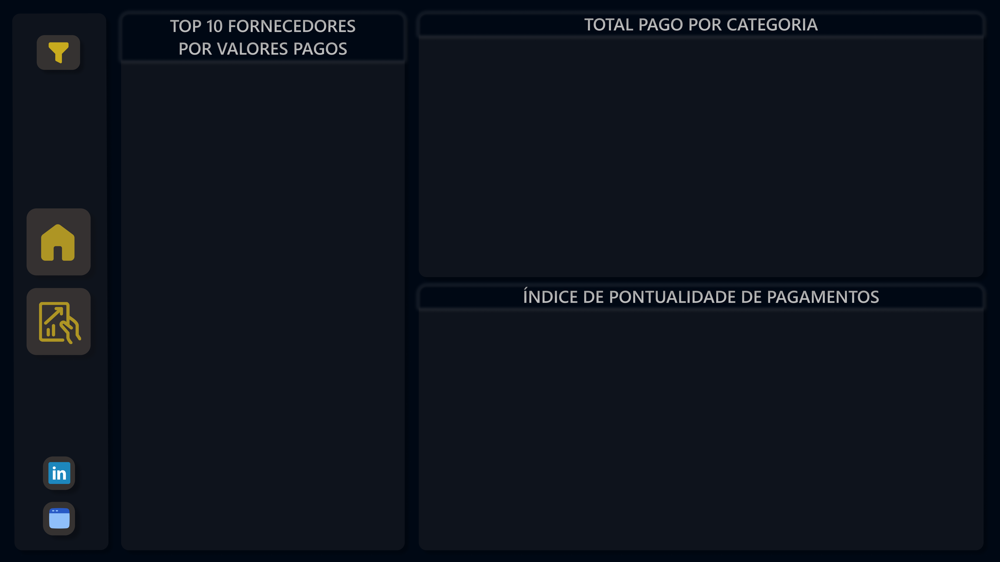

# Dashboard de Gestão Financeira - Contas a Pagar

Este projeto consiste em um dashboard desenvolvido no **Power BI** utilizando dados fictícios criados especificamente para simular uma operação financeira real [cite: 2026-02-24].

## 📝 Descrição
O dashboard foi construído para monitorar o fluxo de obrigações financeiras, permitindo uma gestão eficiente de vencimentos, pagamentos e saúde do fluxo de caixa. Toda a base de dados foi estruturada de forma fictícia para dar suporte às análises do projeto [cite: 2026-02-24].

**O objetivo do dashboard é** fornecer uma visão clara do montante total a pagar, identificar gargalos de atrasos e medir o impacto de juros e multas no orçamento mensal.

## 💼 O Problema de Negócio
Foi simulado um cenário onde uma empresa apresentava dificuldades em visualizar suas saídas de caixa futuras e entender o custo gerado por pagamentos fora do prazo. O dashboard foi criado como uma solução para centralizar esses dados e gerar alertas visuais sobre os compromissos financeiros.

## ❓ Perguntas de Negócio
O painel foi projetado para responder às seguintes questões:
1. Qual o valor total das contas a pagar no mês?
2. Qual a porcentagem de contas que estão vencidas atualmente?
3. Qual o valor total pago em juros e multas devido a atrasos?
4. Qual a distribuição das despesas por categoria de custo?
5. Quais fornecedores possuem os maiores volumes de pagamentos pendentes?

## 🛠️ Metodologia
Este projeto foi um marco importante na minha jornada, sendo o **primeiro dashboard que desenvolvi do início ao fim de forma totalmente independente**, sem o auxílio de vídeo aulas ou roteiros de cursos.
# Dashboard de Gestão Financeira - Contas a Pagar

Este projeto consiste em um dashboard desenvolvido no **Power BI** utilizando dados fictícios criados especificamente para simular uma operação financeira real [cite: 2026-02-24].

## 📝 Descrição
O dashboard foi construído para monitorar o fluxo de obrigações financeiras, permitindo uma gestão eficiente de vencimentos, pagamentos e saúde do fluxo de caixa. Toda a base de dados foi estruturada de forma fictícia para dar suporte às análises do projeto [cite: 2026-02-24].

**O objetivo do dashboard é** fornecer uma visão clara do montante total a pagar, identificar gargalos de atrasos e medir o impacto de juros e multas no orçamento mensal.

## 💼 O Problema de Negócio
Foi simulado um cenário onde uma empresa apresentava dificuldades em visualizar suas saídas de caixa futuras e entender o custo gerado por pagamentos fora do prazo. O dashboard foi criado como uma solução para centralizar esses dados e gerar alertas visuais sobre os compromissos financeiros.

## ❓ Perguntas de Negócio
O painel foi projetado para responder às seguintes questões:
1. Qual o valor total das contas a pagar no mês?
2. Qual a porcentagem de contas que estão vencidas atualmente?
3. Qual o valor total pago em juros e multas devido a atrasos?
4. Qual a distribuição das despesas por categoria de custo?
5. Quais fornecedores possuem os maiores volumes de pagamentos pendentes?

## 🛠️ Metodologia
Este projeto foi um marco importante na minha jornada, sendo o **primeiro dashboard que desenvolvi do início ao fim de forma totalmente independente**, sem o auxílio de vídeo aulas ou roteiros de cursos.

* **Tratamento e Transformação de Dados:** Utilização do **Power Query** para limpeza, tipagem e organização das tabelas fictícias.
* **Criação de Métricas com DAX:** Desenvolvimento de medidas para cálculos de juros acumulados, totais em atraso e indicadores percentuais.
* **Estruturação do Dashboard:** Definição da hierarquia de dados e navegação entre páginas.
* **Criação da Aba Retrátil de Filtros:** Implementação de menus dinâmicos para otimizar o espaço visual do painel.
* **Design no Figma:** **Pela primeira vez, utilizei o Figma** para criar todo o layout e interface UX/UI, garantindo um visual profissional e personalizado.

## 💡 Insights Principais
* Identificação de períodos críticos de vencimento que podem comprometer o fluxo de caixa.
* Detecção de categorias de custo que mais sofrem com a incidência de juros por falta de liquidez imediata.
* Otimização da visão operacional, permitindo antecipar pagamentos de grandes fornecedores.

## 🖼️ Prévia do Dashboard

### Página 1: Home

### Página 2: Operacional

### Página 3: Performance

## 📂 Base de Dados
* Os dados utilizados foram gerados internamente em Excel para simular extrações de um sistema ERP corporativo [cite: 2026-02-24].

## 🚀 Tecnologias Utilizadas
* **Power BI** (Power Query, DAX, Visualização de Dados)
* **Figma** (Design de Interface e Layout)
* **Excel** (Estruturação da base de dados fictícia)

---
**Desenvolvido por:** Pedro Ramos
* **Tratamento e Transformação de Dados:** Utilização do **Power Query** para limpeza, tipagem e organização das tabelas fictícias.
* **Criação de Métricas com DAX:** Desenvolvimento de medidas para cálculos de juros acumulados, totais em atraso e indicadores percentuais.
* **Estruturação do Dashboard:** Definição da hierarquia de dados e navegação entre páginas.
* **Criação da Aba Retrátil de Filtros:** Implementação de menus dinâmicos para otimizar o espaço visual do painel.
* **Design no Figma:** **Pela primeira vez, utilizei o Figma** para criar todo o layout e interface UX/UI, garantindo um visual profissional e personalizado.

## 💡 Insights Principais
* Identificação de períodos críticos de vencimento que podem comprometer o fluxo de caixa.
* Detecção de categorias de custo que mais sofrem com a incidência de juros por falta de liquidez imediata.
* Otimização da visão operacional, permitindo antecipar pagamentos de grandes fornecedores.

## 🖼️ Prévia do Dashboard

### Página 1: Home

### Página 2: Operacional

### Página 3: Performance

## 📂 Base de Dados
* Os dados utilizados foram gerados internamente em Excel para simular extrações de um sistema ERP corporativo [cite: 2026-02-24].

## 🚀 Tecnologias Utilizadas
* **Power BI** (Power Query, DAX, Visualização de Dados)
* **Figma** (Design de Interface e Layout)
* **Excel** (Estruturação da base de dados fictícia)

---
**Desenvolvido por:** Pedro Ramos